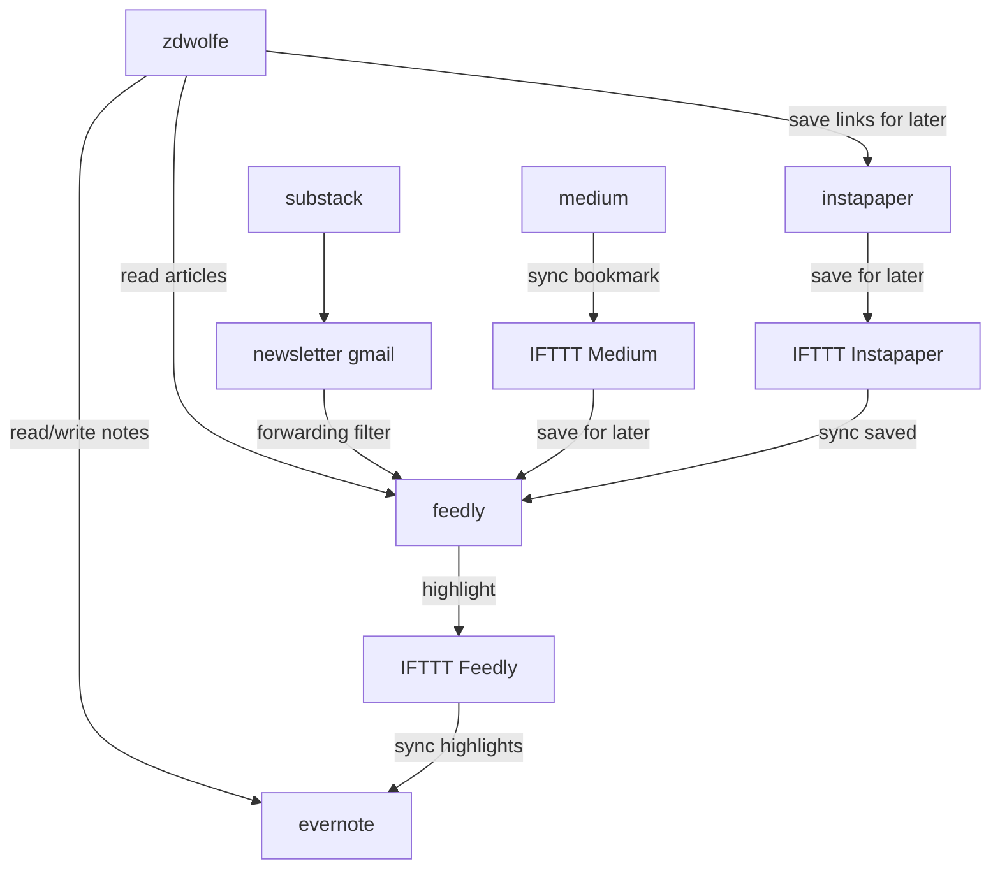

# Reading

An overview of my web reading setup.

# Stack

# References
1. https://refactoring.fm/p/how-to-read-online?utm_source=url
1. https://refactoring.fm/p/my-tools?utm_source=url
1. https://github.blog/2022-02-14-include-diagrams-markdown-files-mermaid/
1. https://mermaid-js.github.io/mermaid
